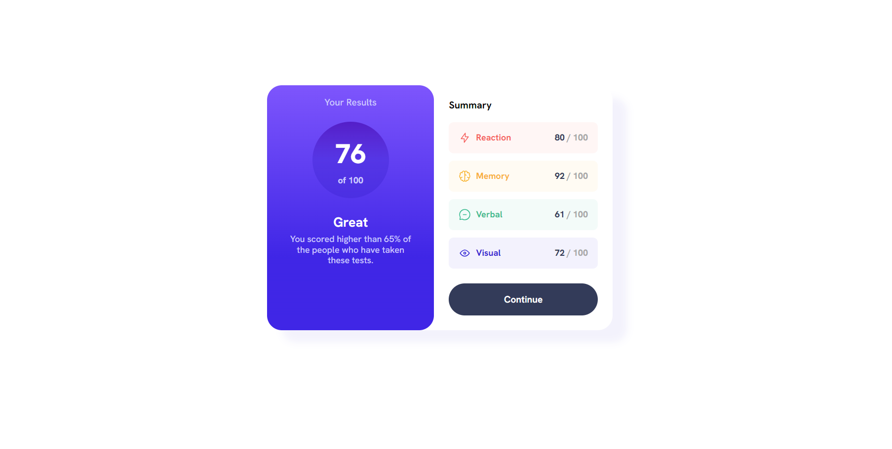

# Results summary component

## Table of contents

- [Overview](#overview)
- [Style Guide](#style-guide)
  - [Layout](#layout)
  - [Colors](#colors)
    - [Primary](#primary)
    - [Gradients](#gradients)
    - [Neutral](#neutral)
  - [Typography](#typography)
    - [Body Copy](#body-copy)
    - [Font](#font)
  - [Screenshot](#screenshot)
  - [Links](#links)
- [My process](#my-process)
  - [Built with](#built-with)
  - [What I learned](#what-i-learned)
  - [Useful resources](#useful-resources)
- [Author](#author)

## Overview

Users should be able to:

- View the optimal layout for the interface depending on their device's screen size
- See hover and focus states for all interactive elements on the page

Build out this results summary component and get it looking as close to the design as possible.
Use the local `data.json` file provided to add the results and total score dynamically.

## Style Guide

## Layout
The designs were created for the following widths:
- Mobile: 375px
- Desktop: 1440px

## Colors
#### Primary
- Light red: hsl(0, 100%, 67%)
- Orangey yellow: hsl(39, 100%, 56%)
- Green teal: hsl(166, 100%, 37%)
- Cobalt blue: hsl(234, 85%, 45%)

#### Gradients
- Light slate blue (background): hsl(252, 100%, 67%)
- Light royal blue (background): hsl(241, 81%, 54%)
- Violet blue (circle): hsla(256, 72%, 46%, 1)
- Persian blue (circle): hsla(241, 72%, 46%, 0)

#### Neutral
- White: hsl(0, 0%, 100%)
- Pale blue: hsl(221, 100%, 96%)
- Light lavender: hsl(241, 100%, 89%)
- Dark gray blue: hsl(224, 30%, 27%)

## Typography
#### Body Copy
- Font size (paragraphs): 18px

#### Font
- Family: [Hanken Grotesk](https://fonts.google.com/specimen/Hanken+Grotesk)
- Weights: 500, 700, 800

### Screenshot




### Links

- Live Site URL: [Github Pages Hosting](https://stevenoyes.github.io/result-summary-component/)

## My process

### Built with

- Semantic HTML5 markup
- CSS custom properties
- Flexbox
- CSS Grid
- Mobile-first workflow
- [React](https://reactjs.org/) - JS library
- [Next.js](https://nextjs.org/) - React framework

### What I learned

I gained insights and learned several key lessons that have enhanced my understanding and skills as a developer. I improved the semantic HTML structure, responsive CSS layouts with CSS Grid, and asynchronous data retrieval with fetch, see below:

This not only improves accessibility but also provides clearer meaning to search engines and developers reading the code.
```html
<!-- Use of semantic HTML -->
<section>
  <header>
    <h1>About Me</h1>
  </header>
  <article>
    <h2>Introduction</h2>
    <p>...</p>
  </article>
  <article>
    <h2>Education</h2>
    <p>...</p>
  </article>
  <article>
    <h2>Skills</h2>
    <ul>
      <li>...</li>
      <li>...</li>
    </ul>
  </article>
  <footer>
    <p>...</p>
  </footer>
</section>
```

By defining a grid container and specifying the number of columns (grid-template-columns), I can easily adjust the layout for different screen sizes. In this case, the grid changes to two columns when the screen width is 768 pixels or less, allowing for a more optimal viewing experience on smaller devices.
```css
/* CSS Grid used for responsive layout */
.container {
  display: grid;
  grid-template-columns: repeat(3, 1fr);
  grid-gap: 20px;
}

@media screen and (max-width: 768px) {
  .container {
    grid-template-columns: repeat(2, 1fr);
  }
}
```

```js
// Used fetch API for HTTP requests
fetch('https://api.example.com/data')
  .then(response => response.json())
  .then(data => {
    // Handle the retrieved data
    console.log(data);
  })
  .catch(error => {
    // Handle any errors that occurred during the fetch request
    console.error(error);
  });
```
Additionally, error handling is implemented using the catch() method to log any errors that may occur during the request.

### Useful resources

- [Example resource 1](https://example.com) - This helped me for XYZ reason. I really liked this pattern and will use it going forward.
- [Transfonter](https://transfonter.org/) - Modern and simple css @font-face generator. TTF, OTF, WOFF, WOFF2 or SVG, 15 MB per file.
- [The Markdown Guide](https://markdownguide.org/) - If you want more help with writing markdown, I'd recommend checking out their site to learn more.

## Author

- Website - [Add your name here](https://www.your-site.com)
- Github - [@yourusername](https://www.twitter.com/yourusername)
- LinkedIn - [yourusername](https://www.linkedin.com)