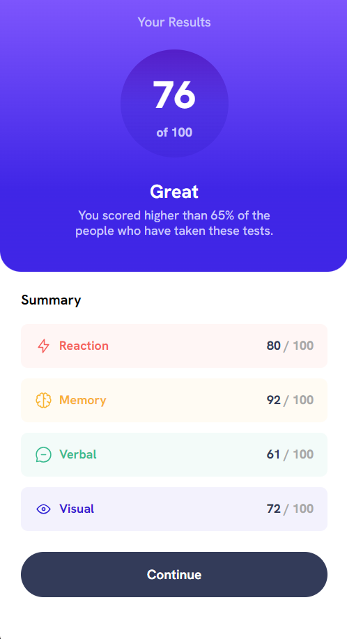

# Results summary component

## Table of contents

- [Overview](#overview)
- [Style Guide](#style-guide)
  - [Layout](#layout)
  - [Colors](#colors)
    - [Primary](#primary)
    - [Gradients](#gradients)
    - [Neutral](#neutral)
  - [Typography](#typography)
    - [Body Copy](#body-copy)
    - [Font](#font)
  - [Screenshot](#screenshot)
  - [Links](#links)
- [My process](#my-process)
  - [Built with](#built-with)
  - [What I learned](#what-i-learned)
  - [Useful resources](#useful-resources)
- [Author](#author)

## Overview

Users should be able to:

- View the optimal layout for the interface depending on their device's screen size
- See hover and focus states for all interactive elements on the page

Build out this results summary component and get it looking as close to the design as possible.
Use the local `data.json` file provided to add the results and total score dynamically.

## Style Guide

## Layout
The designs were created for the following widths:
- Mobile: 375px
- Desktop: 1440px

## Colors
#### Primary
- Light red: hsl(0, 100%, 67%)
- Orangey yellow: hsl(39, 100%, 56%)
- Green teal: hsl(166, 100%, 37%)
- Cobalt blue: hsl(234, 85%, 45%)

#### Gradients
- Light slate blue (background): hsl(252, 100%, 67%)
- Light royal blue (background): hsl(241, 81%, 54%)
- Violet blue (circle): hsla(256, 72%, 46%, 1)
- Persian blue (circle): hsla(241, 72%, 46%, 0)

#### Neutral
- White: hsl(0, 0%, 100%)
- Pale blue: hsl(221, 100%, 96%)
- Light lavender: hsl(241, 100%, 89%)
- Dark gray blue: hsl(224, 30%, 27%)

## Typography
#### Body Copy
- Font size (paragraphs): 18px

#### Font
- Family: [Hanken Grotesk](https://fonts.google.com/specimen/Hanken+Grotesk)
- Weights: 500, 700, 800

### Screenshot




### Links

- Live Site URL: [Github Pages Hosting](https://stevenoyes.github.io/result-summary-component/)

## My process

### Built with

- Semantic HTML5 markup
- CSS
- Flexbox
- Mobile-first workflow

### What I learned

I gained insights and learned several key lessons that have enhanced my understanding and skills as a developer. I improved the semantic HTML structure, responsive CSS layouts with CSS.

This not only improves accessibility but also provides clearer meaning to search engines and developers reading the code.
```html
<!-- Use of semantic HTML -->
<div class="bottom">
  <h2>Summary</h2>
  <div class="criteria">
    <div class="reaction summaries">
      
      <p class="width-set">Reaction</p>
      <p class="fractional">80 <span class="fractional-position">/ 100</span></p>
    </div>
    <div class="memory summaries">
      
      <p class="width-set">Memory</p>
      <p class="fractional">92 <span class="fractional-position">/ 100</span></p>
    </div>
    <div class="verbal summaries">
      
      <p class="width-set">Verbal</p>
      <p class="fractional">61 <span class="fractional-position">/ 100</span></p>
    </div>
    <div class="visual summaries">
      
      <p class="width-set">Visual</p>
      <p class="fractional">72 <span class="fractional-position">/ 100</span></p>
    </div>
    <button>Continue</button>
  </div>
</div>
```

By defining a container and specifying the columns, I can easily adjust the layout for different screen sizes.
```css
/* CSS Grid used for responsive layout */
.reaction {
  color: var(--lite-red);
  background-color: hsla(0, 100%, 67%, 0.072);
}

.memory {
  color: var(--orangey-yellow);
  background-color: hsla(39, 100%, 56%, 0.072);
}

.verbal {
  color: var(--green-teal);
  background-color: rgba(0, 189, 145, 0.072);
}

.visual {
  color: var(--cobalt-blue);
  background-color: hsla(234, 85%, 45%, 0.072);
}
```

### Useful resources

- [Mozilla Developers Network](https://developer.mozilla.org/en-US/) - Documenting for web technologies, including CSS, HTML, and JavaScript.
- [Transfonter](https://transfonter.org/) - Modern and simple css @font-face generator. TTF, OTF, WOFF, WOFF2 or SVG, 15 MB per file.
- [The Markdown Guide](https://markdownguide.org/) - If you want more help with writing markdown, I'd recommend checking out their site to learn more.

## Author

- Website - [Portfolio](https://stevenmnoyes.com)
- Github - [Github Profile](https://github.com/SteveNoyes/)
- LinkedIn - [LinkedIn Profile](https://www.linkedin.com/in/steven-noyes/)